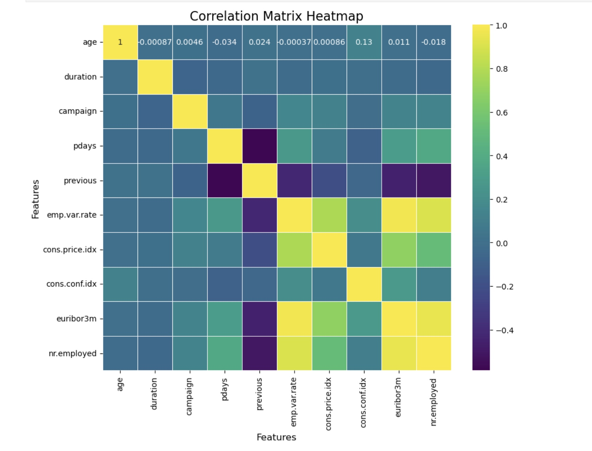

**Business Goal**

Effectiveness of Marketing campaigns are critical for continued success of businesses around the world in the increasingly competitve environment. A rigorous process in understanding the various factors impacting effective campaigns will help improve outcome for future campaigns. This study used to determine factors driving the effectiveness of a marketing campaign based on the data collected from portuguese marketing campaign related to bank deposit subscription

The business goal is to find a model that can explain success of a contact, i.e. if the client subscribes the deposit. This model can increase campaign efficiency by identifying the main characteristics that affect success, helping in a better management of the available resources (e.g. human effort, phone calls, time) and selection of a high quality and affordable set of potential buying customers.

Objective of this study

- Understand the relationship between various features affecting the success of a campaign
- Build and evaluate multiple classficication models to predict success of a contact, i.e. if the client subscribes the deposit.
- Provide actionable insights to improve effectiveness of future marketing campaigns

**Data**

- Data for this analysis was collected by a Portuguese bank that used its own contact-center to do directed marketing campaigns.The telephone, with a human agent as the interlocutor, was the dominant marketing channel

Initial analysis on data shows class imbalances in several categorical features like default, housing, and loan, where the "no" category significantly outweighs the "yes" category. This imbalance could lead to model bias, and techniques such as resampling or class weighting might be necessary to address this.

Certain features, like job and month, reveal interesting patterns. For example, students have a higher success rate (31.4%) compared to other occupations, and December and March show unusually high success rates, suggesting possible seasonal effects. These patterns indicate that features like job, month, and education could be highly influential in predictions.

There are outliers in features like month and education, and some categories, such as illiterate, have very few instances, which might need to be merged or handled separately.

**Summary**

The testing of various models revealed that the SVC classifier delivered the highest performance, achieving an accuracy of 0.905. This result surpasses our baseline and demonstrates significant potential for practical use by the banks that provided the testing data.

Banks could leverage this SVC model, along with customer information, to predict whether a customer is likely to purchase their product. If a sale is likely, resources could be redirected to customers less inclined to buy. These customers could then be targeted with promotions and special offers to increase the likelihood of a successful sale.

While the best source of data for this model remains the banks themselves, supplementary data can be obtained from online sources. However, this externally sourced data will likely require cleaning, and the model may need adjustments to accommodate different feature sets.
